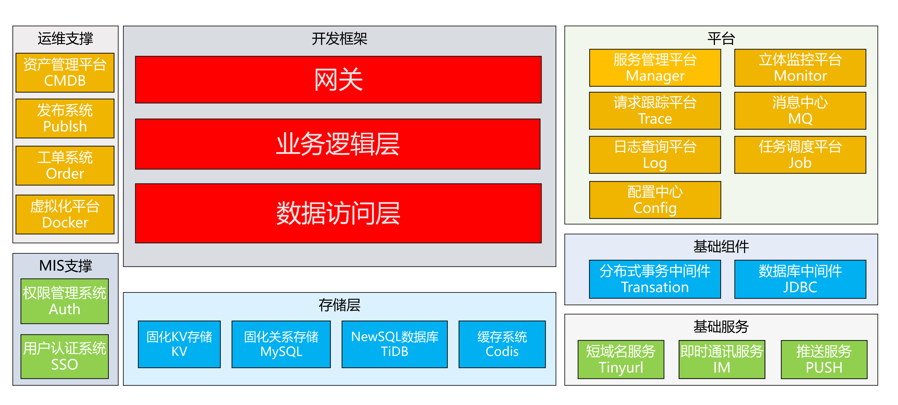

# 微服务基础架构（Golang 实现）

## 前言

如果你工作多年，但是最整个系统架构的全景没有足够的了解，又或者是想要深入了解底层的架构设计，那么这本电子书可能会为你解答疑惑。

目前市面上大多数有关于架构的书籍都是讲“道”，对于“术”的书却很少，这也就导致了很多人之后认为自己懂了，但是等到了实际操作的时候却抓瞎了，无法落地，而这本电子书就是为了解决这个问题。

本书将由浅入深的对基础架构进行讲解，甚至有的模块将带领代价从0 到 1 的进行实现。

### 面向的人群

1. 有 3 三年以上开发经验的开发者
2. 具有 Golang 基础

## 大纲

这本电子书将围绕着这张图上的内容进行逐一讲解，甚至是从 0 到 1 的实现这一整套基础架构。

##  勘误

e-mail:guozhu123@outlook.com

## 赞助作者

