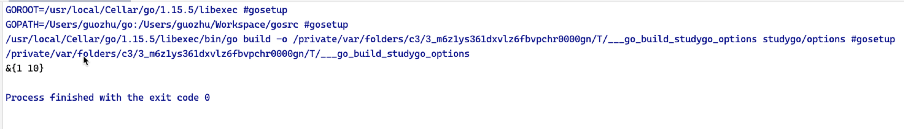

# Golang 设计模式之选项模式

我们先来看一下面的代码。

```java
public class HttpClient {
    public int maxIdel;
  
    public int timeout;
  
    public void HttpClient(int timeout){
      this.timeout = timeout
    }   
 
    //以下两个参数类型顺序不同
    public String HttpClient(int maxIdel,int timeout){
      this.maxIdel = maxIdel;
      this.timeout = timeout
    }   
}
```

这段 Java 代码是在模拟实现一个 HttpClient 的工具类，我们通过 Java 重载的特性可以让http client 变的更灵活，通过对构造方法的重载，实现定制化我们需要的客户端实例。

但是在 Golang 中并没有重载的概念，我们就必须在不同的场景使用不同的函数，并且参数传递方式可能不同的人写出来是不同的样子，这将导致代码可读性差，维护性差。这个时候就可以使用 option 模式来解决这个问题。

Option 模式的专业术语为：`Functional Options Pattern（函数式选项模式）`

Option 模式为 golang的 开发者提供了将一个函数的参数设置为可选的功能，也就是说我们可以选择参数中的某几个，并且可以按任意顺序传入参数。

### 变长参数列表

在这之前，首先需要介绍一下可变长参数列表，顾名思义，就是参数的个数不固定，可以是一个也可以是多个，最典型的用法就是标准库里面的 `fmt.Printf`，语法比较简单，如下面例子实现任意多个参数的加法

```go
func add(nums ...int) int {
    sum := 0
    for _, num := range nums {
        sum += num
    }
    return sum
}
```

在类型前面加 `...` 来表示这个类型的变长参数列表，使用上把参数当成 `slice` 来用即可

### 选项模式

假设我们要实现这样一个函数，这个函数接受5个参数，三个 `string`（其中第一个参数是必填参数），两个 `int`，这里功能只是简单输出这个参数，于是我们可以简单用如下代码实现

```go
func MyFunc1(requiredStr string, str1 string, str2 string, int1 int, int2 int) {
    fmt.Println(requiredStr, str1, str2, int1, int2)
}

// 调用方法
MyFunc1("requiredStr", "defaultStr1", "defaultStr2", 1, 2)
```

这种实现比较简单，但是同时传入参数较多，对调用方来说，使用的成本就会比较高，而且每个参数的具体含义这里并不清晰，很容易出错

那选项模式怎么实现这个需求呢？先来看下最终的效果

```go
MyFunc2("requiredStr")
MyFunc2("requiredStr", WithOptionStr1("mystr1"))
MyFunc2("requiredStr", WithOptionStr2AndInt2("mystr2", 22), WithOptionInt1(11))
```

如上面代码所示，你可以根据自己的需求选择你需要传入的参数，大大简化了函数调用的复杂度，并且每个参数都有了清晰明确的含义

那怎么实现上面的功能呢?

#### 定义可选项和默认值

首先定义可选项和默认值，这里有4个可选项，第一个参数为必填项

```go
type HttpClient struct {
	Timeout     int
	MaxIdle     int
}
```

#### 实现 With 方法

这些 With 方法看起来有些古怪，接受一个选项参数，返回一个选项方法，而选项方法以选项作为参数负责修改选项的值，如果没看明白没关系，可以先看函数功能如何实现

```go
type Option func(client *HttpClient)

func WithTimeout(timeout int) Option {
	return func(client *HttpClient) {
		client.Timeout = timeout
	}
}


func WithMaxIdle(idle int) Option {
	return func(client *HttpClient) {
		client.MaxIdle = idle
	}
}
```

#### 实现函数功能

```go
func NewHttpClient(options ...Option) *HttpClient {
	http := &HttpClient{}
	for _, opt := range options {
		opt(http)
	}
	return http
}

```

使用 With 方法返回的选项方法作为参数列表，用这些方法去设置选项.

让我们来运行一下这个段代码：




完整实现：

```golang
package main

import "fmt"

type HttpClient struct {
	Timeout int
	MaxIdle int
}

func NewHttpClient(options ...Option) *HttpClient {
	http := &HttpClient{}
	for _, opt := range options {
		opt(http)
	}
	return http
}

type Option func(client *HttpClient)

func WithTimeout(timeout int) Option {
	return func(client *HttpClient) {
		client.Timeout = timeout
	}
}

func WithMaxIdle(idle int) Option {
	return func(client *HttpClient) {
		client.MaxIdle = idle
	}
}

func main() {
	http := NewHttpClient(WithTimeout(1), WithMaxIdle(10))
	fmt.Println(http)
}

```

### 选项模式的应用

从这里可以看到，为了实现选项的功能，我们增加了很多的代码，实现成本相对还是较高的，所以实践中需要根据自己的业务场景去权衡是否需要使用。个人总结满足下面条件可以考虑使用选项模式

1. 参数确实比较复杂，影响调用方使用
2. 参数确实有比较清晰明确的默认值
3. 为参数的后续拓展考虑

在 golang 的很多开源项目里面也用到了选项模式，比如 grpc 中的 rpc 方法就是采用选项模式设计的，除了必填的 rpc 参数外，还可以一些选项参数，grpc_retry 就是通过这个机制实现的，可以实现自动重试功能

### 参考链接

- golang 设计模式之选项模式:[https://www.cnblogs.com/hatlonely/p/8543927.html](https://www.cnblogs.com/hatlonely/p/8543927.html)
- Go 函数式选项模式：https://studygolang.com/articles/12329
- Functional Options Pattern in Go：https://halls-of-valhalla.org/beta/articles/functional-options-pattern-in-go,54/